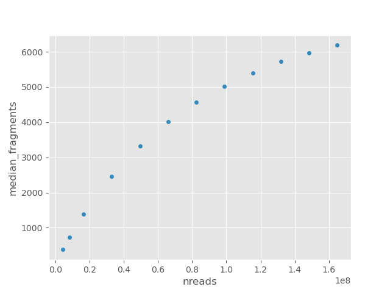

# Tool to downsample and estimate complexity of nano-CT data

The tool takes as input ```possorted_bam.bam``` file from cellranger and list of cell barcodes ```barcodes.tsv```. 
It outputs a tsv file with median/mean number of fragments per cell as function of number of reads.

## Prepare environment
```
conda create -n complexity.yaml
conda activate complexity
```


## Example usage

```
python3 complexity.py -i possorted_bam.bam -c barcodes.tsv -t 8 -o OUT_FOLDER
```
barcodes.tsv contains list of barcodes that will be considered as cells (one barcode per line)
```
head barcodes.tsv
AAACGAACACTGATAC-1
AAACGAACATCGAGTT-1
AAACGAACATTACACG-1
AAACGAAGTTGGAGGT-1
AAACGAATCCAGAATC-1
AAACGAATCGAGGTCC-1
AAACGAATCGGAAAGC-1
AAACTCGAGCGTGTTT-1
AAACTCGAGCTAACAA-1
AAACTCGAGTGTCGCC-1

wc -l barcodes.tsv
4327 barcodes.tsv 

```

barcodes can be extracted from nanoscope output using following script:
```
# Cellranger output - column 10 (is__cell_barcode) is 1 for cell barcodes
awk 'BEGIN{FS=","; OFS="\t"} $10 == 1 {print $2}' singlecell.csv | sed 's/\"//g' > barcodes.tsv

# Nanoscope output - column 28 (passedMB) is TRUE for cell barcodes
awk 'BEGIN{FS=","; OFS="\t"} $28 == "TRUE" {print $2}' singlecell.csv | sed 's/\"//g' > barcodes.tsv
```

## Output

```
head OUT_FOLDER/complexity.tsv

	nreads	median_fragments	mean_fragments
0.025	4118388.0	379.0	636.7576994434137
0.05	8241385.0	737.0	1237.1903525046382
0.1	16487009.0	1382.0	2336.7684601113174
0.2	32972932.0	2461.0	4192.144341372913
0.3	49464174.0	3324.0	5680.670871985158
0.4	65962070.0	4006.0	6886.130983302412
0.5	82444621.0	4563.0	7868.688682745826
0.6	98926733.0	5024.0	8676.079406307977
0.7	115426388.0	5400.0	9344.447495361781
```



## Dependencies
```
Python:
numpy, pandas, matplotlib, pysam

Bash:
samtools, sinto
```

```